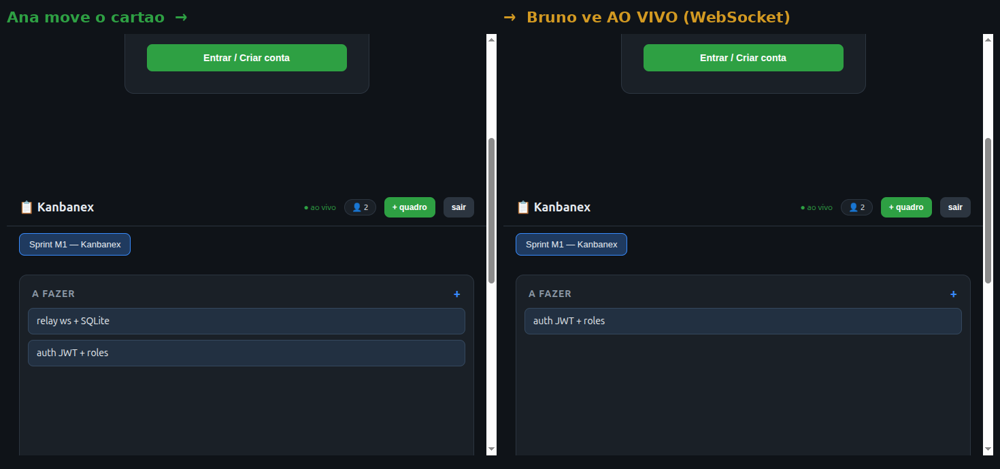
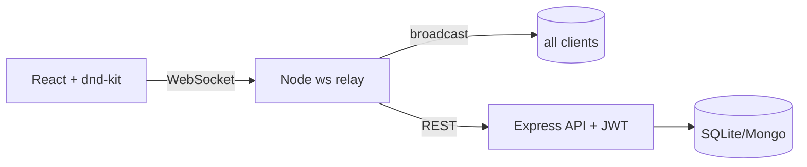

# Kanbanex — Real-time Collaborative Kanban

-brightgreen)


A real-time collaborative Kanban board — shared boards, drag & drop, live presence
(who's online, live card moves) built on a custom WebSocket relay, with JWT auth.

> 🇧🇷 Kanban colaborativo em tempo real — quadros compartilhados, drag & drop,
> presença ao vivo (quem está online, movimentos de cards em tempo real) sobre um
> relay WebSocket próprio, com autenticação JWT.

## Why this project matters

Real-time sync is the most common senior-interview topic (concurrency, state, optimistic
updates, conflict handling). Kanbanex implements it from the socket up — no Firebase,
no paid services: a Node `ws` relay (battle-tested in my
[chat_criptografado](https://github.com/FrancosCorporation/chat_criptografado) project),
presence tracking, and a React + dnd-kit front-end.

## Proof — real-time sync (M1 live)



**8/8 integration tests passing**, including: two WebSocket clients see the same card move,
live card creation, and concurrent moves without state corruption (`npm test`).

## Features

- [x] **M1** — Boards & cards with native drag & drop, JWT auth, SQLite persistence, live presence (👤 online counter), real-time moves/creates via custom ws relay
- [x] Tests: auth flow, REST CRUD, ws 2-client sync, concurrency (node --test)
- [x] CI (lint/test/Docker/Trivy/license-check) + docker-compose
- [ ] **M2** — Yjs CRDT for position/text (ADR-001), reconnect re-sync, UI polish (dnd-kit migration for touch)
- [ ] **M3** — Audit history, link invites

## Architecture



## Quick start (planned)

```bash
docker compose up   # app + ws + db
```

## Built with

- Custom WebSocket relay — pattern proven in
  [FrancosCorporation/chat_criptografado](https://github.com/FrancosCorporation/chat_criptografado) (MIT)
- UI inspiration: [knowankit/trello-clone](https://github.com/knowankit/trello-clone) (MIT)
- Sync reference: [automerge/trellis](https://github.com/automerge/trellis) (MIT)

## License

MIT — Rodolfo Franco ([FrancosCorporation](https://github.com/FrancosCorporation))

---

### 🇧🇷 Sobre (PT-BR)

Kanban colaborativo em tempo real: quadros compartilhados com drag & drop, presença
ao vivo e movimentos instantâneos via WebSocket relay próprio. Roadmap de 3 milestones
no [PROJETOS_RH.md do workspace](https://github.com/FrancosCorporation). Construído para
demonstrar domínio de tempo real, concorrência e sincronização de estado.
